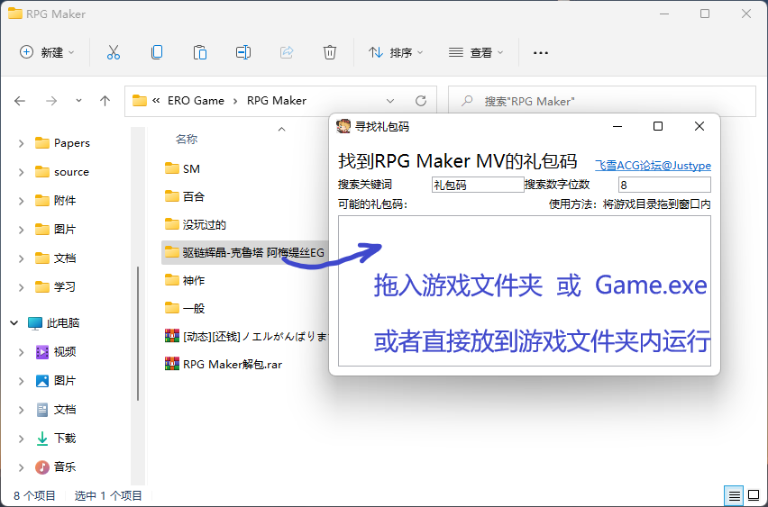
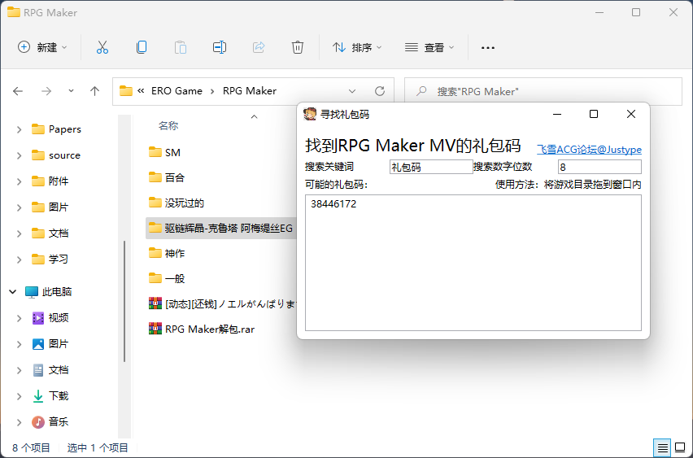

# 找到RPG Maker MV 里的礼包码

## WPF 版本

3种使用方法，任君挑选

- 将运行文件放到游戏目录下运行
- 将游戏目录（或者Game.exe）拖到exe文件
- 将游戏目录（或者Game.exe）拖到窗口内

使用 .NET Framework 4.7，WIN10 和 WIN11 运行无压力，WIN7可能要安装运行环境

## Python 版本

使用方法，将`rpgmaker_giftcode.py`放到 `www/data` 文件夹下运行即可

# 原理

原因：

1. RPG Maker MV 里面的 `www/data/` 文件夹是存放所有游戏资源的目录
2. 地图中的人物都在其单独的地图文件下，也就是`MapXX.json`
3. 一般礼包码都是8位数，且是与地图上一个NPC对话后获得的

所以，只要遍历所有`MapXX.json`文件，选出其中包含`礼包码`这三个字的文件，并找出其中的8位数字即可。
